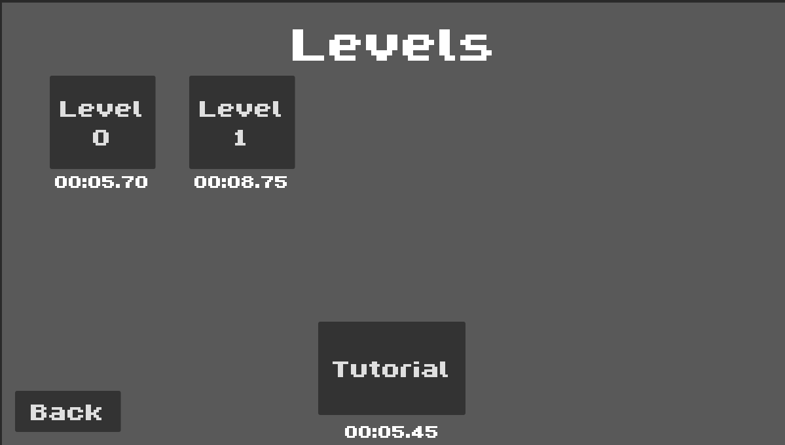
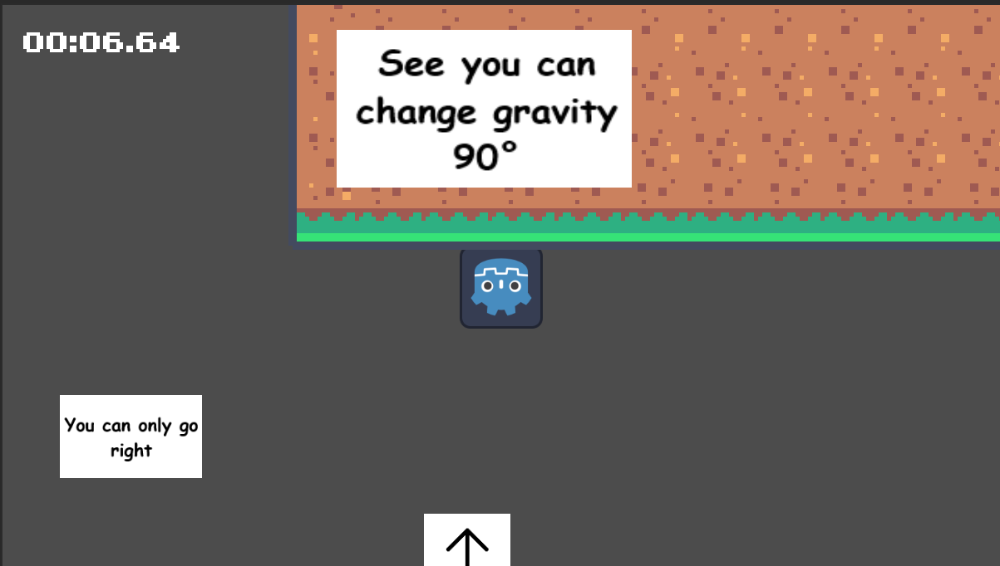

Okay so as the title suggests you can only go in one direction, but the twist is that by double pressing your
selected movement key you can change the rotation/gravity of the player 90°.

You need to (currently) beat 2 levels (more to come) with this challenge. You can change rotation in the air or
beat the level in any way.

There's also a speedrun timer that displays your best time (badges are coming in the next update). Can you be the fastest or will you suffer. (like I did)

One Goal, One Direction

Some pictures of the game:

(Beat my time)

